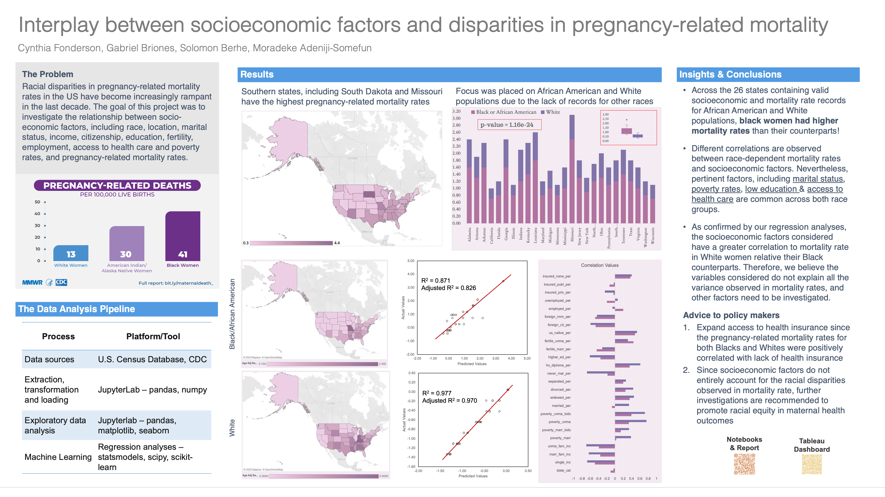

# Data Science for All by Correlation One Capstone Project
**Team 26**: Cynthia Fonderson, Gabriel Briones, Solomon Berhe, Moradeke Adeniji-Somefun

This folder contains the work my team and I completed in fulfillment of our DS4A Fellowship. For our capstone project, we chose to investigate the interplay between racial disparities in pregnancy-related mortality and socioeconomic factors. Selected factors considered include:
`race`, `income`, `marital status`, `education`, `employment`, `access to health care`, `fertility`, `poverty rates`, `citizenship`, and `location`.

