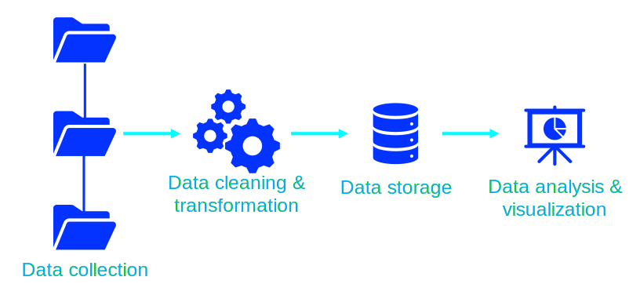

# Data Analytics Projects
End-to-end data analytics projects that walk you through the data pipeline, i.e., data collection, data cleaning, transformation and storage, data analysis and data visualization and story telling.

## Projects at a glance
[Investigating the global impact of COVID-19](https://github.com/cfonderson/portfolio/tree/main/Data%20Analytics/COVID%20Investigation)  
Use data collected from Our World in Data to explore the impact the COVID-19 pandemic had on the world at large  
Tags: `Web scraping` `SQL` `Python` `Tableau`

[Designing and building a relational database for business management](https://github.com/cfonderson/portfolio/tree/main/Data%20Analytics/Business%20Management%20DB) 
Help a local restaurant owner to design a build a relational database and dashboarding system for KPI, supply and labor monitoring  
Tags: `Databse Design` `SQL` `Python` `Looker Studio`

[Investigating the sales performance of a bike company](https://github.com/cfonderson/portfolio/tree/main/Data%20Analytics/Bike%20X%20Sales) 
Evaluate the sales performance of stores and sales personel of a bicycle company  
Tags: `SQL` `Python` `Microsoft Excel` `Tableau`

[Your Guide to Micromobility in YYC](https://github.com/cfonderson/portfolio/tree/main/Data%20Analytics/E-Cycling%20in%20YYC) 
Analyzing the popularity of the micromobility pilot in Calgary, AB  
Tags: `Python` `App` `Plotly` `Dash` `Data Viz`
