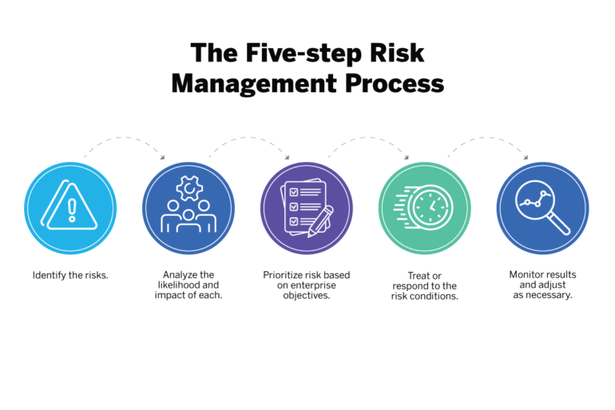

# Risk Analytics in Banking and Financial Services

Financial risk analytics is an evolving function in the financial sector that provides products and solutions to financial institutions to measure and manage their counterparty credit risk, market risk, regulatory risk capital and derivative valuation adjustments. 

## The Data
This project leverages a financial dataset sourced from Kaggle user `manukulamkombil` to provide insight into whether an organization may face a financial risk or not.

The data has been pre-split into training and testing sets, containing 543 and 233 records, respectively. Seven (7) features were used to predict risk, namely `city`, `location_score`, `internal_audit_score`, `external_audit_score`, `fin_score`, `loss_score`, and `past_results`. 

## Modeling
For this project, classification algorithms were trained and tested to predict financial risk at different locations of the organization. Particularly, Logistic Regression, Decision Tree Classifier, Random Forest Classifier and Dense Neural Network models were evaluated to create a predictive solution for this business.

## Results
The Support Vector Classifier outperformed others with an ROC AUC Score of 0.80 and a precision score of 0.91. Thus, it was subsequently used to analyze financial risk in new (i.e., untrained data).
